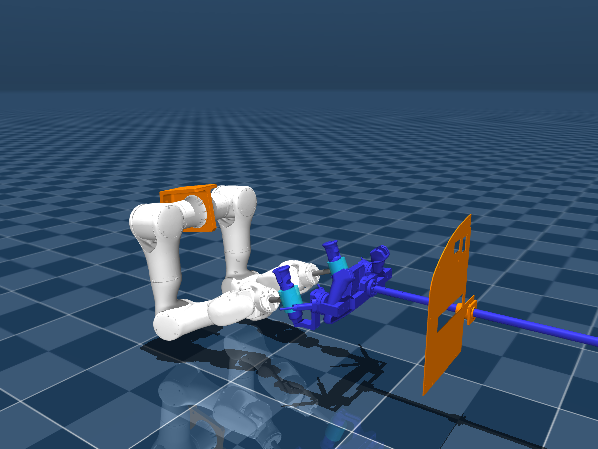

# AviatorRobot 双臂操纵盘控制

`aviator::Aviator` 管理左右两个 `rocos::Robot`，共用一个 `rocos::Hardware`。
底层代码直接编译自 `third_party/rocos_app`（原 RCMRobot 项目），上层负责双臂同步、抓取和操纵盘运动。
控制程序与 MuJoCo 是独立进程，控制器仅下发双臂 14 轴目标。操纵盘两轴始终
没有 actuator，通过双臂与把手之间的两组 weld 约束被动运动。

## 编译和运行

在 AVIATOR 仓库根目录执行。需要 C++17、CMake、Boost、Eigen3、yaml-cpp、
orocos-kdl、urdfdom、TinyXML/TinyXML2、OpenSSL；其他控制依赖随 `third_party/rocos_app` 提供。
可视化另需 GLFW/OpenGL。

```bash
# 编译仿真器
cmake -S reference/rocos-mujoco -B reference/rocos-mujoco/build/aviator-visual \
  -DCMAKE_BUILD_TYPE=Release -DROCOS_MUJOCO_ENABLE_VISUALIZATION=ON
cmake --build reference/rocos-mujoco/build/aviator-visual -j4

# 编译控制器
cmake -S AviatorRobot -B AviatorRobot/build -DCMAKE_BUILD_TYPE=Release
cmake --build AviatorRobot/build -j4
```

终端 1 启动仿真：

```bash
./reference/rocos-mujoco/build/aviator-visual/bin/rocos_mujoco_sim -v
```

终端 2 启动自动演示，约两分钟完成接近、锁定、正反向约 50° 转动、160 mm 推拉、返回和解锁：

```bash
./AviatorRobot/build/bin/aviatorAppMain --demo
```

不加 `--demo` 进入交互模式，依次输入以下命令。运动命令异步执行，收到完成状态后
再下发下一条；运动期间可以输入 `status` 或 `stop`。

```text
enable
approach
lock
wheel 0.87266 0 8
wheel -0.87266 0 16
wheel 0 0 8
wheel 0 -0.16 8
wheel 0 0 8
unlock
disable
quit
```

`wheel` 的参数为绝对转角（rad）、绝对推拉位移（m）、运动时间（s，可省略，默认 4）。
零位和正方向沿用 `urdf/aviator.urdf`：转角范围 `[-0.87266, 0.87266]`，
位移范围 `[-0.165, 0]`。合法数值还必须通过双臂的共同可达性、关节位置/速度和
碰撞检查，并不保证整个矩形范围都可执行。演示验证的目标为
`(+0.87266, 0)`、`(-0.87266, 0)`、`(0, 0)`、`(0, -0.16)`、`(0, 0)`。
`0.87266 rad` 是 URDF 的限位，约等于 50°；转角和推拉组合的整个矩形区域没有逐点验收。

两个进程可通过同一个 `--ecat-id N` 使用另一组共享内存。
`--config /path/to/aviator.yaml` 可覆盖控制配置。支持从其他工作目录启动。

## C++ 接口

头文件为 `include/aviator/Aviator.hpp`，链接 CMake 目标 `aviator`：

```cpp
aviator::Aviator robot("AviatorRobot/config/aviator.yaml", 0);
robot.Init();
robot.Enable();
robot.ApproachHandles();
robot.LockHandles();
robot.MoveWheel(0.87266, 0, 8.0);
auto feedback = robot.GetStatus();
robot.UnlockHandles();
robot.Disable();
```

公共动作接口为阻塞调用，错误通过 `std::runtime_error` 返回。每个实例同一时刻执行一个动作。
`Stop()` 可从另一线程调用，中止规划或执行，并让两臂保持当前位置；已经建立的抓取
约束保留。`UnlockHandles()` 显式释放约束。异常后可以先 `unlock`、`reset`，再重新接近。
`GetStatus()` 返回操纵盘实测位置/速度、左右位姿误差、ready/locked/fault 和命令确认。
`GetState()` 返回控制器动作状态；它与仿真端的锁定状态分别报告。

## 配置与模型

- `config/aviator_control.urdf` 从原始 `urdf/aviator.urdf` 生成，补充 ROCOS 使用的
  `<hardware>` 节点。左臂 1–7 轴对应从站 0–6，右臂对应 7–13，操纵盘无驱动映射。
- `config/grasp.json` 是模型与控制器共用的抓取定义。`left/right.position` 和
  `quaternion`（wxyz）是圆柱中心坐标系相对 `steering_wheel` 的目标位姿。
  圆柱自身 Z 轴与把手握持段中心轴对齐，抓取后保持完整相对位姿。
- `tool.position/quaternion` 定义法兰到圆柱中心的完整刚体变换。默认中心沿法兰 Z 轴
  延伸 100 mm，绕法兰 Y 轴转 90°，所以圆柱轴沿法兰 X 轴，横向安装在连接杆末端。
  `tool.radius/length/mass` 默认分别为 28 mm、60 mm、0.15 kg，尺寸用 m，质量用 kg。
  `mount_radius` 为连接杆半径。连接杆止于圆柱外表面，圆柱有真实碰撞体和惯量。
  仿真中半透明青色圆柱表示抓握代理，灰色杆表示连接件，红点为圆柱中心，绿点为把手目标。
- `handle_geometry` 中的 `center/axis` 来自握持外壳网格（左 31、右 33 号分离部件）
  的唯一顶点主轴拟合，均在操纵盘坐标系中。`half_length=0.065` 定义可用握持段半长。
  握持外壳为曲面，圆柱是覆盖握持段的代理几何，不是整个外壳的精确曲面复制。
  控制器检查圆柱轴与握持轴共线，且圆柱长度没有超出可用握持段。
  当前左右中心均沿握持轴偏移 -20 mm；绕握持轴的搜索角分别为 0° 和 345°（即 -15°）。
- `approach_distance=0.06` 是预接近距离，沿法兰负 Z 方向后退 60 mm，随后沿安装杆方向
  靠近把手。初始姿态再后退 30 mm，为接近过程留出空间。
- `config/aviator.yaml` 配置接近时长、规划步长、关节速度和跟踪阈值。
  `config/posture.json` 统一配置初始角度、接近种子和第 2 关节范围，单位为度。
  种子选择肘部下沉的分支，实际动作仍重新求逆解并检查整条轨迹。
- 模型中的 `left_grasp` / `right_grasp` 初始未激活，分别连接 TCP 和操纵盘上的把手 site。
  锁定要求两侧位置误差小于 3 mm、角度误差小于 0.035 rad、相对线/角速度分别小于
  0.02 m/s 和 0.02 rad/s，并持续稳定 0.1 s。两侧一起锁定，远距离请求会被拒绝。
- 接近分为关节空间运动到预接近位姿，以及末端沿笛卡尔路径对准把手。
  锁定后对操纵盘的两个坐标做平滑插值，计算两个把手的目标位姿，再连续求双臂逆解。
  两臂使用同一条时间轴；完整轨迹通过检查后才开始运动。
- 接近与操纵阶段的逆解均限制两臂第 2 关节在 `[85.5°, 94.5°]`，为要求的
  `[85°, 95°]` 留出每侧 0.5° 跟踪余量。TRAC-IK 优先选择靠近上一点的解，
  同时保留位置、姿态、碰撞及速度检查。执行和稳定等待期间监测实测角度，
  越界即停止；初始角度不在范围内时禁止使能，不自动从其他姿态回到范围内。
  操纵目标在受限构型下不可达或不能连续到达时，规划会拒绝且不下发新的关节目标。
- 座舱和操纵盘的碰撞网格按 CAD 的分离部件拆开，分别使用凸包近似，保留原外观。
  这避免整块凸包填满座舱空隙。它仍不是精细凹面碰撞或真实夹爪抓握仿真；
  抓取由 weld 模拟。圆柱与对应握持外壳及其按钮的有意重叠通过碰撞位掩码排除：
  左侧只排除 31/34/35，右侧只排除 33/36/37，接近及锁定阶段均适用。
  圆柱与相对侧把手、另一圆柱、座舱、地面、把手底座及其他机械臂部件仍参与碰撞检查。
  连接杆也参与碰撞，不采用整条机械臂与整个操纵盘的碰撞排除。
  轨迹检查采样间隔默认 20 ms，并检查中点；穿透超过 1 mm 的接触会拒绝执行。

默认启动姿态如下（J1 到 J7，单位为度）：

| 机械臂 | J1 | J2 | J3 | J4 | J5 | J6 | J7 |
| --- | ---: | ---: | ---: | ---: | ---: | ---: | ---: |
| 左臂 | 111.596 | 90 | -78.849 | 117.446 | 8.987 | 4.179 | 8.991 |
| 右臂 | -105.917 | 90 | 63.866 | 110.981 | -10.314 | 3.939 | -39.745 |

两臂第 2 关节都取正号；这组构型的肘部（第 4 关节原点）位于肩部下方约 0.31 m。
初始末端位于把手附近但尚未抓取，先执行 `enable`、`approach`、`lock` 后再操纵。
生成器将初始角度写入 `aviator_home` keyframe，无头与可视化仿真启动时均加载该姿态。
URDF 零位、物理限位和编码器偏置保持原定义；不要用 MJCF 的 joint `ref` 设置初始角度。

修改原始 URDF 或抓取配置后，在仓库根目录重新生成并构建两个工程：

```bash
python3 reference/rocos-mujoco/scripts/generate_aviator.py
cmake --build reference/rocos-mujoco/build/aviator-visual -j4
cmake --build AviatorRobot/build -j4
```

生成器同时更新 MJCF、仿真 YAML、碰撞网格和控制 URDF。修改 `posture.json` 后也需重新生成。
控制器启动时检查初始角度及抓取配置与
MJCF 是否一致。构建会复制运行资源到 `build/bin/`，无需修改原始 URDF。

## 联合搜索抓取位置和姿态

`aviator_grasp_search` 离线读取模型，不连接驱动。它沿每个握持轴扫描 -20/0/+20 mm，
绕轴每 15° 扫描一次，每臂共 72 个位置/姿态组合。圆柱的对称性提供抓取前的朝向选择；
锁定后仍是固定 weld，不在运动时放开相对旋转。

搜索先检查单臂接近、完整转动及推拉路径，再组合两臂检查相互碰撞。
保留 J2 的受限逆解、完整末端姿态和 0.7 rad/s 速度上限，按峰值关节速度选择通过的组合。
离线筛选采样为 0.2 s，另检查轨迹中点；部署后运行时仍用 20 ms 规划并重新验证。
这是有限网格与连续逆解搜索，不代表全局最优，也不保证所有配置都能找到方案。

```bash
# 输出候选和轨迹，不直接修改当前模型。
./AviatorRobot/build/bin/aviator_grasp_search \
  AviatorRobot/config/aviator.yaml /tmp/aviator-grasp-result

# 采用通过的结果，随后生成资源并构建。
python3 AviatorRobot/scripts/apply_grasp_selection.py /tmp/aviator-grasp-result/selection.json
python3 reference/rocos-mujoco/scripts/generate_aviator.py
cmake --build reference/rocos-mujoco/build/aviator-visual -j4
cmake --build AviatorRobot/build -j4
```

当前选定结果及离线轨迹保存在 `validation/cylinder_grasp/`；初始筛选转角为 0.872 rad，
实际集成测试和演示使用 URDF 全限位 0.87266 rad。
其中 `headless-test.txt`、`visual-test.txt` 保存实际进程验证结果，
`locked.png` 是由离线零位对齐关节解渲染的圆柱抓取预览。



## 通信与底层适配

驱动数据使用仿真器的 `/ecmN`、`/pd_inputN`、`/pd_outputN`。
新工程通过 `ROCOS_MUJOCO_BACKEND` 选择其原始 POSIX 布局，避免误用旧 ECM 的
Boost managed-shared-memory 布局。rocos_app 原有构建继续使用原后端。

`/aviatorN` 是带版本号的抓取命令和状态通道。进程共享互斥锁保护双臂 14 轴的整批目标
写入与仿真读取；控制器仅使用一个同步周期，两个 Robot 不创建各自的后台运动线程。
该模式明确使用 URDF 运动链，避免工作目录里的 `robotDH.yaml` 替换双臂几何。
驱动解析也支持链中的固定安装段和末端段。

通道包含控制器占用和心跳。控制器检测到反馈超时、跟踪误差或失去锁定时停止两臂；
仿真器检测到锁定误差持续超限或控制器心跳消失时置故障并保持双臂位置。
该工程目前面向 MuJoCo 仿真联调。

## 自动化验证

先构建无头仿真器，再运行测试：

```bash
cmake -S reference/rocos-mujoco -B reference/rocos-mujoco/build/aviator-headless \
  -DCMAKE_BUILD_TYPE=Release -DROCOS_MUJOCO_ENABLE_VISUALIZATION=OFF
cmake --build reference/rocos-mujoco/build/aviator-headless -j4
ctest --test-dir reference/rocos-mujoco/build/aviator-headless --output-on-failure
ctest --test-dir AviatorRobot/build --output-on-failure
```

集成测试自动启动两个独立进程，使用独立总线 ID，完成后清理测试共享内存。
验证未锁定时禁止操纵、仿真端拒绝远距离锁定、接近运动可中止、双侧锁定、非法参数
不改写关节目标、正反向转动/推拉的实测跟踪以及解锁。验收阈值：操纵盘误差小于
0.005 rad / 1 mm，抓取点误差小于 2 mm / 0.01 rad。
另检查启动时 J2 为 +90°、肘部低于肩部且无接触；集成测试按约 1 ms 周期采样接近和
操纵过程的 J2 指令及实测值，要求两臂均在 `[85°, 95°]`，并验证过快轨迹被拒绝后目标不变。
还检查圆柱、对应把手、相对侧把手、地面和座舱之间的碰撞位掩码，防止误关其他碰撞。
如仿真器在别处构建，可通过 CMake 的 `AVIATOR_TEST_SIMULATOR` 指定其可执行文件。
