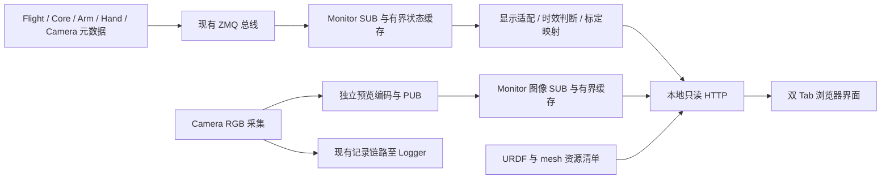
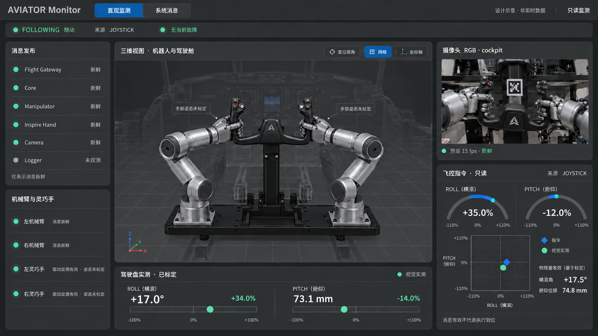
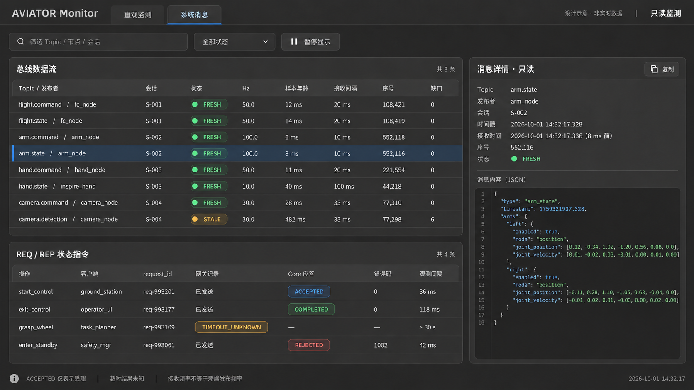
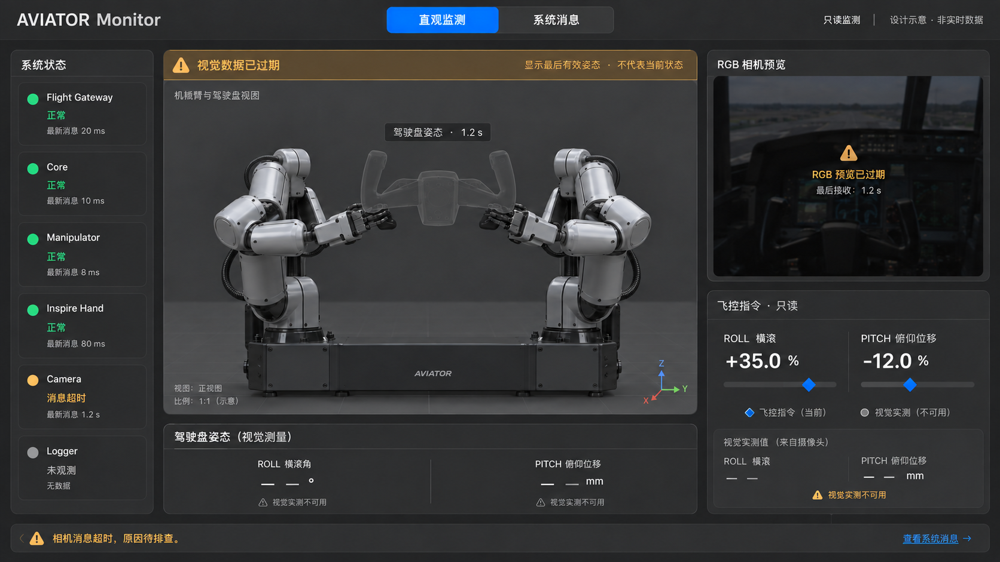
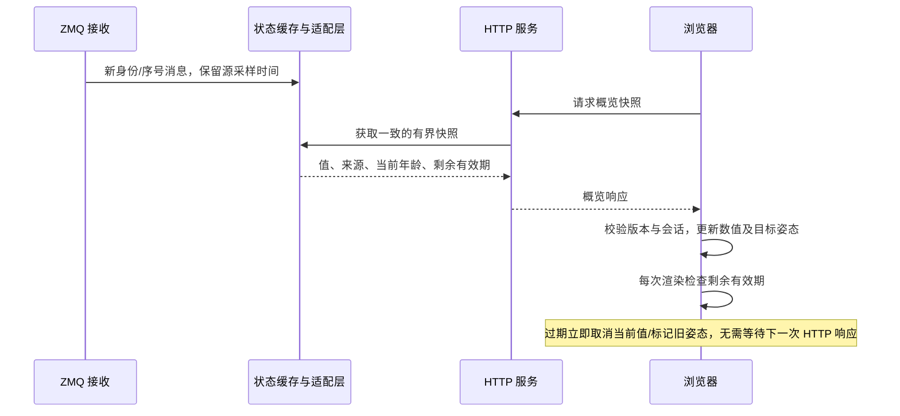

# AVIATOR Monitor 双 Tab 界面设计方案

版本：0.2 · 日期：2026-10-01 · 状态：设计基线，实施情况见节点 README

本文将 [aviator_monitor](../nodes/aviator_monitor/README.md) 扩展为“直观监测＋系统消息”两个页面：前者用于观察机械臂、灵巧手、驾驶盘、摄像头和飞控指令，后者用于定位总线与服务事务问题。视觉遵循 [AVIATOR Web UI 视觉设计规范](AVIATOR_WebUI视觉设计规范.md)，保持中灰三维画布、深灰面板、蓝色交互强调和紧凑工程界面。

本次交付为设计文档和三张效果参考图，不包含节点、前端或通信协议实现。文中的新增接口、配置和刷新率均为建议；示意图中的设备造型、视频、数值、发布者及时间均为设计占位，不能作为真实模型、消息 Schema 或运行结果。

> 实施记录（2026-10-01）：[Monitor 代码与使用说明](../nodes/aviator_monitor/README.md) 已提供双 Tab、实际关节显示、独立 RGB 预览、配置化标定和时效降级。实现中概览最高 50 Hz，消息表保持 10 Hz，以满足 50 ms 机械臂反馈显示阈值。手部/驾驶盘的实测标定参数仍需部署时配置；本文效果图保留概念设计身份。

## 1. 设计目标与现有基础

### 1.1 目标

- **直观监测**：用三维模型与少量关键指标回答“整套系统现在是什么状态”，无需阅读 JSON。
- **系统消息**：保留数据源、时效、序号和 REQ/REP 证据，支持从异常概览跳转到对应消息。
- **只读监测**：允许旋转视角、筛选、复制、暂停页面显示；不增加执行、握持、启停、指令发送或关节拖动控制。
- **可信表达**：分开表达消息持续发布、反馈有效、视觉检测成功和业务动作完成，避免一个绿灯代替所有判断。

### 1.2 当前能力与拟新增能力

| 项目 | 仓库当前能力 | 本方案新增设计 |
| --- | --- | --- |
| 数据接入 | C++17 节点 SUB 订阅总线 `5556` | 继续使用；增加类型化显示适配层和独立 RGB 预览订阅。 |
| 页面 | 原生 HTML/CSS/JS，构建时嵌入可执行文件 | 双 Tab；引入 Three.js 与 URDFLoader，前端资源本地打包。 |
| HTTP | 默认 `127.0.0.1:8081`；`/api/state`、`/api/message?id=N` | 概览快照、模型资源清单、带身份标识的 RGB 帧读取接口。 |
| 刷新 | 浏览器每 100 ms 获取摘要，不重叠请求 | 摘要沿用 10 Hz 起步；三维独立渲染；RGB 独立刷新。 |
| 机器人 | 在原始 JSON 中查看关节和设备反馈 | URDF 双臂姿态、双手驱动反馈及标定后的手部姿态。 |
| 摄像头 | `camera.detection`，含目标位姿与有效性 | 标定后换算驾驶盘 roll/pitch，新增 RGB 预览。 |
| 服务事务 | 订阅 `record.service.request/reply` 副本 | 保留关联和状态语义，重新组织列表与详情。 |
| 缓存 | 最多 64 条流、64 项服务事务，每流最新消息 | 保持有界；新增图像及显示历史同样限定数量和大小。 |

“无需 Node.js 运行时”可以保留；引入 Three.js 后，现有“无外部前端依赖”的描述需在实施时更新。构建阶段可使用前端打包工具，部署时只需要本地静态资源和现有监测服务。

## 2. 信息架构与全局布局

### 2.1 固定两个一级 Tab

| 页面 | 核心问题 | 主要内容 |
| --- | --- | --- |
| 直观监测 | 机器人和驾驶盘处于什么状态？指令与观测分别是什么？ | 三维模型、RGB、发布指示灯、机械臂/灵巧手摘要、驾驶盘测量、飞控指令。 |
| 系统消息 | 哪个源、哪个 Topic 或哪笔事务异常？ | 总线数据流、REQ/REP 记录、原始消息详情、接收异常统计。 |

切换 Tab 不重新建立 ZMQ 订阅，不清除服务事务，也不重置三维视角。页面内的筛选或折叠不形成第三个一级 Tab。离开直观页时暂停三维渲染和 RGB 拉取，后端接收继续运行。

### 2.2 全局区域

顶部导航高 56～64 px，左侧为 `AVIATOR Monitor`，中部为两个 Tab，右侧为“只读监测”和 HTTP 连接状态。产品正常运行时不显示“设计示意”标签，该标签仅用于本文效果图。

导航下方使用一条约 40 px 的紧凑状态栏，显示运行状态、控制来源、当前故障及数据新鲜度。整机状态仅来自唯一有效的 `flight.state`；无有效来源时显示“整机状态未知”，多个候选来源时显示“来源冲突”。HTTP 可访问只表示监测服务在线。

不要使用“全部正常”合并所有结论。历史故障与当前故障分开，当前消息中的无故障信息也不能覆盖某一设备已过期的反馈。

### 2.3 桌面尺寸与自适应

默认设计画板为 1920×1080 CSS px，整体外边距和面板间距均为 16 px，面板圆角 16 px。左右列与中央画布使用真实网格布局，避免面板遮住模型关键部位。

| 视口宽度 | 左侧概览列 | 右侧信息列 | 中央三维可用宽度 | 布局行为 |
| --- | ---: | ---: | ---: | --- |
| 1920 px | 260 px | 440 px | 1156 px | 三列；右侧上 RGB、下指令。 |
| 1600 px | 240 px | 360 px | 936 px | 三列；减少次要标签，不缩小关键值。 |
| 1280～1439 px | 左侧概览并入可展开横条 | 320 px | 按剩余空间分配 | 保留三维与右侧两列；模型自动适配无遮挡区域。 |
| 小于 1280 px | 合并为摘要区 | 改为纵向卡片 | 全宽三维区 | 页面纵向滚动；不承诺手机端与桌面同等信息密度。 |

三列中央宽度计算为 `视口宽度 − 2×外边距 − 左列 − 右列 − 2×列间距`。高度不足 800 px 时允许内容区滚动，保持顶部导航可见，不强行将所有文字缩小。

## 3. Tab 1：直观监测

### 3.1 页面组合

```text
┌ AVIATOR Monitor ── [直观监测] [系统消息] ── HTTP 在线 / 只读 ┐
│ 运行状态 · 控制来源 · 当前异常 · 数据状态                  │
├────────────┬───────────────────────────┬─────────────────┤
│ 消息发布   │ 三维视图：双臂、双手、驾驶盘 │ 摄像头 RGB      │
│ 节点指示灯 │ 视角 / 网格 / 坐标轴         │ 预览 / 帧状态   │
├────────────┤                           ├─────────────────┤
│ 机械臂     │                           │ 飞控指令        │
│ 灵巧手     ├───────────────────────────┤ Roll / Pitch    │
│ 反馈摘要   │ 驾驶盘实测：角度、位移、百分比│ 指令与实测对照  │
└────────────┴───────────────────────────┴─────────────────┘
```

中央三维场景占主要面积。左列提供轻量状态，右列承载图像与指令。首页不显示 Topic 列表、JSON 或完整 REQ/REP 表格；点击异常摘要跳到系统消息页并带入对应筛选条件。

### 3.2 消息发布指示灯

每个节点一行：圆点＋节点名＋短状态。默认列出 Flight Gateway、Core、Manipulator、Inspire Hand、Camera；Logger、Bus 仅在配置了可观测状态源时判定，否则显示“未观测”。实际发布者身份由配置映射，不根据显示名称猜测。

| 灯态 | 文案 | 判断依据 |
| --- | --- | --- |
| 绿色 | 发布新鲜 | 该节点配置的预期周期流近期到达，序号持续推进。 |
| 黄色 | 消息超时／部分流超时 | 超过对应接收阈值，或多个必需流仅部分新鲜。 |
| 红色 | 来源冲突／消息异常 | 同一显示角色出现多个有效候选，或可归因的连续格式错误；详情说明原因。 |
| 灰色 | 未观测／未配置 | 尚无样本，或没有独立可观测源。 |

灯态只表示**监测端观察到的消息发布情况**，不保证进程存活或硬件健康。重复与乱序消息不能刷新健康时刻。Camera 持续发布 `SEARCHING`、`valid=false` 时，发布灯仍可绿色，但视觉检测显示“未检测到目标”。不根据“总线上还有其他消息”将所有节点点亮。

悬停或键盘聚焦只显示最近接收间隔、期望周期及状态原因，不弹出原始消息；点击后跳到对应发布者的消息列表。

### 3.3 机械臂与灵巧手摘要

左右臂分别显示“反馈新鲜／反馈过期／反馈无效”，必要时附 enabled、状态与错误码。不要把 `enabled` 自动改写为“已授权操纵飞机”。展开后可查看七个关节的简洁数值；原始消息仍放在第二页。

左右手分别显示实际六通道驱动位置条、反馈年龄和姿态标定状态。默认缩略展示，展开后依次列出拇指旋转、拇指、食指、中指、无名指、小指。原始驱动值范围为 0～1000，归一化值为 0～1；这些值不是关节角，也不是握力。

当前手节点的 `joint_position` 尚为空，因此初期界面必须同时满足：

1. 真实显示六通道驱动反馈，区分实际反馈与目标回显。
2. 三维手部保持灰色参考姿态，并标注“姿态未标定”。
3. 标定映射可用后，才由实际驱动反馈计算手部三维姿态，并标注“驱动反馈估算姿态”。

`grasp_verified=false` 时不显示“已握紧”。软件侧 enabled 和零错误码也不能替代真实握持验证。

### 3.4 三维机器人视口

使用 Three.js＋[URDFLoader](https://github.com/gkjohnson/urdf-loaders)，默认加载完整的 [models/urdf/aviator.urdf](../models/urdf/aviator.urdf)。当前完整模型包含双臂、手部独立关节与 mimic 关节、驾驶盘输入关节，适合作为可视化基线；简化控制模型不作为默认显示模型。

视口仅开放视角旋转、平移、缩放，以及复位视角、适配模型、网格、坐标轴、驾驶舱透明度。机械臂、手指、驾驶盘不能拖动产生控制量。默认启用 visual，关闭 collision，采用中灰背景、柔和照明和低对比地面网格。

- 双臂由实际 `arm.state` 更新；目标命令不冒充实际姿态。
- 双手按上一节规则显示；mimic 从属关节交由模型联动更新。
- 驾驶盘由标定后的视觉观测更新，roll 为旋转、pitch 为直线位移。
- 只有某一部件过期时，仅将该部件及标签置灰；其他有效部件继续更新。
- 模型资源加载失败时保留状态卡片和消息页，显示失败资源路径与重载模型入口。

插值只在同来源、同会话、有效且时间顺序正确的样本间进行，用于改善显示平滑度；不外推设备动作。新会话、来源切换或数据失效时立即停止插值。数值读数保留最新有效采样语义，不用插值值替代原始测量。

### 3.5 驾驶盘实测卡片

放在视口下方，左侧 roll 角度与百分比，右侧 pitch 位移与百分比。颜色使用实测绿 `#67D6A0`，同时显示检测状态、校准版本和样本年龄。

换算遵循 [RS422 通信协议](AVIATOR_RS422通信协议规范.md)：

| 量 | 标称映射 | 允许反馈显示范围 |
| --- | --- | --- |
| Roll | `百分比 = 角度 / 50° × 100%` | ±52°，即 ±104%。 |
| Pitch | `百分比 = (位移mm − 85) / 85 × 100%` | −5～175 mm，即约 ±105.882%。 |

扩大反馈范围不改变指令映射。反馈不裁剪到 ±100%；超出标称指令范围的部分使用琥珀色提示。大于物理容许范围或无法通过标定校验的样本显示“越界／不可用”，原值可在详细页追踪。

示例：视觉 roll `+17.0°` 对应 `+34.0%`；pitch `73.1 mm` 对应 `−14.0%`。失效时主数值显示 `—`，最后有效姿态只能以灰色保留并明确标记年龄，不能自动回零。

### 3.6 摄像头 RGB 窗口

右上面板优先保持 16:9，采用等比完整显示，空余区域留暗底，不裁掉用于观察驾驶盘的边缘。头部显示相机名 `cockpit`，底部显示预览接收帧率、图像状态和帧身份；采集帧率与浏览器预览帧率分别命名。

状态包括：等待首帧、预览新鲜、RGB 已过期、预览通道未配置、解码失败。RGB 与检测结果分别判断时效：可以有新图像但没有检测，也可以检测消息正常而预览暂不可用。

默认不绘制检测框。现有检测消息没有完整角点坐标；以后只有获得对应帧的几何信息及相机标定后，才允许叠加标签轮廓或坐标轴。图像与检测须按发布者、会话、camera_id、frame_id 匹配；找不到对应帧时取消叠加，不将最新检测结果贴到任意最新图像。

### 3.7 飞控指令窗口

右下面板显示 `flight.command` 中 roll/pitch 的当前观测值、控制来源、有效性和采样年龄；运行状态与错误摘要来自对应 `flight.state`。不同数据的来源与年龄分别保留。

主要内容：

- 两个只读百分比刻度，标明 ROLL 和 PITCH，指令范围 ±100%。
- 物理等价值：roll 角度、pitch 位移；例如 `+35% → +17.5°`，`−12% → 74.8 mm`。
- 二维对照图：横轴 roll，纵轴 pitch；蓝色菱形为观测指令，绿色圆点为有效视觉实测。
- 对照图坐标范围为 ±110%，用淡框标出 ±100% 标称区域，允许观察反馈越界。
- 来源显式显示 JOYSTICK、FLIGHT 或协议中实际枚举；不得把摇杆来源统一写成飞控计算机。

称为“已发布指令／观测指令”，不能仅凭 ZMQ 数据声称“RS422 已发送成功”或“飞控已接收”。时间未对齐的指令与视觉值仅做位置对照，不标成精确跟踪误差，不推导动作已经执行到位。视觉不可用时移除绿色点，指令有效时蓝色点仍可继续更新。

## 4. Tab 2：系统消息

### 4.1 布局

顶部为 Topic／节点／会话搜索、状态筛选和“暂停显示”。下面左侧约 70% 宽：上方总线数据流，下方 REQ/REP 状态指令；右侧约 30% 为共享消息详情。1600 px 以下允许详情区收起为抽屉，表格保留必要列，次要列进入行详情。

“暂停显示”只冻结该页呈现，不停止接收或业务节点；持续显示暂停时刻与已暂停时长。恢复时跳到最新快照。当前内存缓存不是录制历史，不能提供任意时间回看。

### 4.2 总线数据流表

| 列 | 设计要求 |
| --- | --- |
| Topic／发布者 | 完整值可复制；Topic 与 publisher_id 分层显示。 |
| 会话 | 默认缩写，聚焦显示完整 session_id。 |
| 数据状态 | 保留 FRESH、STALE、INVALID、CLOCK_UNKNOWN、FUTURE、STALE_ORIGIN、EVENT 等具体含义。 |
| 接收 Hz | 监测端最近窗口的接收速率，不命名为源端发布频率。 |
| 样本年龄 | 同时钟域时计算；跨域显示未知，不显示 0 ms。 |
| 最近接收 | 距离最近被接纳的新消息的本地时间。 |
| 序号与缺口 | 完整序号、缺口、重复/乱序统计；详情中解释统计边界。 |

行身份为 `(Topic, publisher_id, session_id)`。新会话生成新行，旧会话自然过期；不得在同一行中混合两个发布者。显示当前缓存条数与淘汰计数，明确“最近缓存，最多 64 条流”。

选中行后在右侧显示原始 JSON 和源信息；使用安全文本渲染，不将消息内容作为 HTML。摘要轮询不反复拉取未选中行的大 JSON；仅选中行需要详情。

### 4.3 REQ/REP 状态指令表

Monitor 继续被动订阅 `record.service.request` 和 `record.service.reply`，不连接 Core 服务端口发送请求。页面展示操作、目标、客户端、请求身份、网关记录、Core 应答、错误码、观测应答间隔和副本计数。

| 类别 | 示例 | UI 语义 |
| --- | --- | --- |
| 网关记录 | QUEUED、NOT_SENT、TIMEOUT_UNKNOWN | 独立一列，说明网关观测；超时表示结果未知。 |
| 等待/关联状态 | WAITING、REPLY_ONLY | 尚未观察到匹配应答，或仅有应答副本。 |
| Core 应答 | ACCEPTED、COMPLETED、REJECTED | 独立一列；受理与完成使用不同徽标。 |
| 观测间隔 | 请求副本到应答副本的本地间隔 | 不称为设备执行耗时，也不冒充链路精确 RTT。 |

关联继续使用客户端、客户端会话和 request_id，并验证目标与服务端会话。同一个请求的新响应可更新结果；旧响应或后来的网关超时记录不能覆盖已知 Core 结果。网关记录与 Core 应答可同时显示，保持原始证据。

PUB/SUB 副本可能丢失，因此“没有应答记录”不证明 Core 未执行。记录次数也不是动作执行次数。列表只保留现有有界缓存，最多 64 项，详情展示 request、reply 及原始文本；不提供重发按钮。

### 4.4 详情与诊断

详情头部显示数据类型、来源、会话、时间和当前是否为旧快照，正文为格式化 JSON；允许复制。服务事务在一个详情区顺序显示请求、响应及记录元数据，不增加一级 Tab。

页面底部显示接收拒绝计数、缓存淘汰数和最近异常。`system.event` 目前只保留每来源最后事件，因此不能包装成完整历史告警列表。HTTP 断开时标记整体旧快照并停止展示当前健康结论。

## 5. 数据驱动与模型映射

### 5.1 数据职责表

| UI 元素 | 数据来源 | 使用要求 |
| --- | --- | --- |
| 整机状态、来源、当前错误 | `flight.state` | 唯一有效源；子设备年龄独立计算。 |
| 飞控指令图形 | `flight.command` | 提取 `/control/roll`、`/control/pitch`；验证范围、来源、有效性。 |
| 左右臂三维姿态 | `arm.state.arms.{left,right}` | 使用实际 joint_position，检查侧级 valid 和 sample_mono_us。 |
| 左右手六通道条 | `hand.state.hands.{left,right}` | 使用 drive_position_raw/normalized；区分 commanded 字段。 |
| 手部三维姿态 | 实际驱动反馈＋标定映射 | 未标定保持未知；未来真实 joint_position 需要版本与单位契约。 |
| 驾驶盘 roll/pitch | `camera.detection.pose`＋几何标定 | 现有消息没有直接 roll/pitch；先变换、求解，再应用物理与模型映射。 |
| RGB 图像 | 拟新增独立图像预览通道 | 图像身份、大小、格式、时效与检测分别管理。 |
| 发布指示灯 | 各预期流的接收统计 | 不把业务 valid 当成是否持续发布的唯一依据。 |
| 服务事务 | `record.service.*` | 保留原有请求关联与网关/Core 分列。 |

概览适配层采用配置的 `(topic, publisher_id, session)` 选择策略，不能让任意最新消息自动夺取模型控制。遇到多个新鲜候选源，显示冲突并停止相应部件更新；来源切换需显式规则，清除跨会话插值。

### 5.2 机械臂与灵巧手关节

| 设备 | URDF 独立关节 | 映射规则 |
| --- | --- | --- |
| 左臂 | `AR5-5_07L-W4C4A2_joint_1`～`_7` | joint_position 数组按已验证的硬件 J1～J7 顺序映射。 |
| 右臂 | `AR5-5_07R-W4C4A2_joint_1`～`_7` | 同上；符号与零偏由关节映射清单明确。 |
| 左手 | `left_thumb_1_joint`、`left_thumb_2_joint`、`left_index_1_joint`、`left_middle_1_joint`、`left_ring_1_joint`、`left_little_1_joint` | 六驱动通道到独立关节的标定函数；不能仅按名称猜对应关系。 |
| 右手 | 对应 `right_` 六个独立关节 | 左右侧独立标定；从属关节由 mimic 联动。 |
| 驾驶盘 | `roll_input_joint`、`pitch_input_joint` | 物理量到模型关节值需符号、零点、量程校准。 |

现有机械臂数组未携带关节名，因此实施时必须建立显式映射清单，不按名称排序后直接赋值。URDFLoader 的转动关节单位为 rad，移动关节单位为 m；空数组、非有限数、长度错误、valid=false 时拒绝姿态更新，即使消息中恰好填了全零。

当前 Inspire Hand 六通道实际位置并非六个已标定弧度值，建议通过每侧/每通道的分段线性曲线或查表函数 `q = f(drive_position)` 建立映射，记录零点、方向、极限和标定版本。`sample_time_basis=host_read_request` 应保留，不伪装成精确硬件采样时间。

### 5.3 相机目标位姿到驾驶盘状态

当前 `camera.detection` 提供相机坐标系下目标位姿，平移单位 m，四元数顺序为 `(qx, qy, qz, qw)`。坐标约定为相机 X 向右、Y 向下、Z 向前。它没有直接提供驾驶盘滚转角和俯仰直线位移。

标定后按以下过程生成只读显示量：

1. 固定相机至机体、标记至驾驶盘的外参，记录驾驶盘零位和运动轴。
2. 使用 `T_aircraft_yoke = T_aircraft_camera × T_camera_tag × T_tag_yoke` 得到驾驶盘在机体坐标系的位姿。
3. 相对零位，根据驾驶盘滚转轴和直线轴的机构模型求解 roll 角度及 pitch 位移，并计算有效性和拟合残差。
4. 应用协议的物理量映射，得到百分比；再经独立的模型显示映射得到 URDF 关节值。

不能直接把相机 Euler pitch 当作俯仰位移，也不能不经外参直接拿相机 Z 值作为驾驶盘行程。置信度属于检测器启发式指标，不表示统计概率；阈值与检测器类型从配置/运行元数据读取。

初期可以在 Monitor 的只读适配层实现标定求解；如果控制链路已有同一标定结果，优先订阅统一的语义反馈，避免各节点使用不同校准。新增上游语义字段属于后续协议设计工作，本文不声称已经存在。

### 5.4 模型限制和资源缺口

当前完整 URDF 中 roll 范围约为 ±50°，pitch 为 `−0.165～0 m`；与协议物理 pitch `0～170 mm`、扩展反馈 `−5～175 mm` 不直接相同。实施前必须确认符号和零位，不能直接使用 `pitch_mm/1000`，也不能默认复用旧控制路径中的映射公式。

可视化应使用明确版本的显示映射和显示限位策略，容纳协议允许的反馈范围。不要被 loader 默认限位静默截断，也不要为此全局关闭所有关节限位。任何显示模型调整都与控制模型隔离，保留原始反馈与越界标记。

当前 visual 资源还存在两处路径差异：URDF 引用 `../meshes/aircraft.STL`、`../meshes/steering_wheel.STL`，仓库文件位于 `models/meshes/Cessna/`。建议使用模型资源清单中的显式别名或准备专用显示资源，实施时校验大小写、所有 visual mesh 和相对路径，不在本次文档任务中修改模型。

模型树解析完成不等于所有 mesh 加载完成。加载面板分别报告模型结构和网格资源进度；缺失资源必须可定位。服务只开放批准的模型目录与清单资源，不将 URL 直接转换成任意本地路径。

## 6. RGB 预览与前后端实现方式

### 6.1 现有链路限制

摄像头目前的图像记录链路通过独立 ZMQ PUSH/PULL 向 Logger 发送数据，且受录制配置影响。Monitor 不能再加入同一 PULL 地址读取图像，否则会与 Logger 分摊帧，破坏录制完整性；也不能额外启动一个相机进程争用设备。

建议由现有 Camera 节点增加独立的预览输出分支：采集线程提供最新 RGB，低优先级工作线程缩放、JPEG 编码并发布。预览与录制独立开关，不依赖 Logger 在线。



### 6.2 建议预览契约

- 独立可配置 endpoint，实施时分配未占用端口；不要默认复用现有 `5557` 图像记录通道或文档已预留的服务记录端口。
- 建议 topic 为 `camera.rgb.cockpit`，使用 topic、元数据 JSON、JPEG 二进制三个消息帧；此为新增设计，不是现有协议。
- 元数据包含 publisher_id、session_id、camera_id、frame_id、sequence、clock_id、sample_mono_us、图像尺寸、编码及缩放/裁剪说明。
- 默认预览 640×360、15 fps，保留完整视野；可按测量结果提高到 1280×720。原始采集和检测频率保持各自配置。
- 采用有界待编码队列和最新帧覆盖策略；避免旧图像积压。图像缓存设置帧数与字节上限，慢浏览器不能阻塞 ZMQ 接收或相机采集。

不把 JPEG base64 塞进控制总线或每次状态 JSON。图像的编码、发送和显示均可丢弃旧预览帧，但不能影响控制消息和录制链路。

### 6.3 HTTP 与浏览器

| 接口 | 状态 | 作用 |
| --- | --- | --- |
| `GET /api/state` | 已有 | 数据流、事务摘要与诊断。 |
| `GET /api/message?id=N` | 已有 | 按当前 ID 查看原始消息或事务。 |
| `GET /api/overview` | 建议新增 | 返回左右臂、左右手、驾驶盘、指令、来源和独立有效性的类型化快照。 |
| `GET /api/model-manifest` | 建议新增 | 模型 URL、资源别名、关节映射、显示校准版本。 |
| `GET /api/camera/latest` | 建议新增 | 最新图像身份、时间、状态及不可变图像 URL。 |
| `GET /api/camera/frame/{token}` | 建议新增 | 读取指定身份的 JPEG；被淘汰后明确返回未找到。 |

概览快照需标记每部分的来源身份和采样时间，不能只给统一顶层时间。图像元数据与 URL 指向同一帧；缓存淘汰后不允许同一个 token 返回另一张图，浏览器重新获取最新元数据即可。

第一阶段使用现有短 HTTP 请求模式：摘要 10 Hz、RGB 最多 15 Hz，每条拉取链路只允许一个未完成请求，完成解码后再替换图片并释放旧对象 URL。三维渲染目标 30～60 fps，与消息刷新分离。无需第一阶段就引入 WebSocket 或 MJPEG 长连接，但需评估 JPEG 负载是否超过当前 HTTP 的连接数和超时预算。

前端依赖固定版本、本地构建和交付，不依赖现场联网 CDN。隐藏 Tab 降低轮询并暂停渲染；恢复前台时先获取最新状态，不把后台定时器延迟判断为源节点故障。

## 7. 时效与异常设计

### 7.1 分开记录的三种时间

1. **接收新鲜度**：Monitor 最近接纳新序号消息的本地时间，用于发布指示灯。
2. **原始样本年龄**：源端采样到现在的时间，仅在时钟域可比较时计算。
3. **设备子反馈年龄**：侧级 sample_mono_us／feedback_age_ms，防止高频外层状态包掩盖旧设备反馈。

当前 Monitor 对 hand.* 使用 50 ms 阈值，而当前 Inspire Hand 状态发布配置为 10 Hz、反馈超时为 300 ms。这会使按旧阈值绘制的手状态频繁过期。实施时必须改为按 Topic/发布者配置的阈值，并与实际节点配置一致，不能只换 UI 标签。

| 数据 | 建议显示判定基线 | 说明 |
| --- | --- | --- |
| flight 状态与指令 | 沿用 100 ms 起步 | 来源业务规则若更严格，以协议和配置为准。 |
| arm 实际反馈 | 沿用 50 ms 起步 | 左右侧分别校验样本。 |
| hand 消息发布 | 按实际周期配置，10 Hz 可从 300 ms 开始 | 发布灯与驱动反馈 valid 分开。 |
| hand 实际反馈 | 遵循节点反馈超时，当前 300 ms | 使用侧级采样年龄；外层新包不能延长硬件反馈有效期。 |
| camera detection | 沿用 200 ms 起步 | valid、检测状态和采样年龄共同决定是否能驱动驾驶盘。 |
| RGB 预览 | 15 fps 可从 500 ms 开始 | 独立于检测时效；仅为显示阈值建议。 |

以上是显示阈值设计，不修改控制保护阈值。阈值应在配置和诊断页可查，禁止直接根据效果图上的示例时间硬编码。

### 7.2 状态降级

| 场景 | 直观页表现 | 系统消息页表现 |
| --- | --- | --- |
| 尚无样本 | 模型参考姿态＋“等待反馈”；数值为 `—` | 空状态，不显示虚构的零值。 |
| 模型缺 mesh | 指出失败资源，其他卡片继续显示 | 保留所有消息观测。 |
| 手未标定 | 驱动反馈条可用，三维手部灰色 | 实际与目标字段清晰区分。 |
| 相机持续发布但检测失败 | 发布灯可绿色，驾驶盘实测不可用 | INVALID／具体检测状态。 |
| 检测过期，RGB 正常 | 视频继续，取消检测叠加，驾驶盘旧姿态置灰 | 检测流 STALE。 |
| RGB 过期，检测正常 | 视频明确冻结和标龄，驾驶盘可继续按有效检测更新 | 预览链路异常独立记录。 |
| 相机两条链路都过期 | 冻结 RGB；驾驶盘旧姿态置灰，实测数值 `—` | 可跳转到相机相关消息。 |
| 指令有效但视觉失效 | 仅显示蓝色指令点，绿色实测点移除 | 两种状态分别追踪。 |
| 来源冲突或时钟未知 | 对应量标未知，不自动选“最后到达者” | 标明候选来源和 clock_id。 |
| HTTP 断开 | 顶部断开提示，所有保留画面标“旧快照” | 保留的详情不得伪装成实时数据。 |

## 8. 视觉与交互规范

沿用已有规范的 Token，不再建立第二套近似色板：页面 `#292929`、面板 `#333333`、画布 `#505050`、输入区 `#3D3D3D`；文字 `#F2F2F2`／`#C8C8C8`；蓝色主按钮 `#006BCC`，选中图形 `#008CFF`。

正常/实测使用 `#67D6A0`，注意/过期 `#F5C66B`，错误/拒绝 `#FF8E86`。蓝色菱形与绿色圆点同时通过形状和图例区分；颜色不作为唯一状态标识。三维坐标轴的 RGB 色属于方向标记，不属于故障状态。

标题 16 px、正文 14 px、辅助标签 12 px；数值与序号使用等宽数字。关键 roll/pitch 数值 24～32 px，单位使用次级文字。百分比读数建议保留一位小数，界面精度与实际数据精度分开，不暗示摄像头具备对应测量精度。

面板标题区高 44～48 px，控件高至少 32 px；所有焦点可见，Tab 切换、表格选择、复制、抽屉关闭支持键盘。动画只服务于姿态可读性，避免常驻闪烁灯、扫光、霓虹与大面积红色遮罩。选中表格行用浅蓝灰底和细蓝边，不遮住状态语义色。

## 9. 效果参考图

以下图片使用内置 imagegen 工具生成，展示布局、配色、组件层级和降级方式。图中的 CAD 设备和 RGB 内容为概念占位，并非直接渲染仓库模型。模型形状、字段名、关节数量、状态枚举及数值单位以本文和实际协议为准；图片不作为像素级实现或数据契约。

### 9.1 直观监测：正常观测

重点：中央双臂与驾驶盘，左侧发布灯和设备摘要，右侧 RGB 与指令，底部驾驶盘实测。手部姿态未标定时有明确提示。



### 9.2 系统消息：数据流与服务事务

重点：总线列表、REQ/REP 事务分区、右侧原始消息详情。网关超时与 Core 应答分列，不混为同一种结果。



### 9.3 直观监测：相机数据过期

重点：局部琥珀色提示、冻结图像和驾驶盘旧姿态、实测不可用；其他仍新鲜的设备及指令继续显示。



图片生成方式、提示词及资产说明见 [参考图说明](assets/aviator_monitor_design/README.md)。

## 10. 实施阶段与验收

### 10.1 建议阶段

| 阶段 | 交付内容 | 前置条件 |
| --- | --- | --- |
| 1：界面与可观测数据 | 双 Tab、现有消息详情重排、发布灯、实际双臂、手驱动条、指令图形 | 字段适配、来源选择、配置化时效；完整模型资源可加载。 |
| 2：RGB 与驾驶盘观测 | 独立预览链路、帧身份匹配、标定后的驾驶盘 roll/pitch | 相机外参、目标安装关系、零点与运动轴完成验证。 |
| 3：手部与性能完善 | 标定后的手部三维联动、模型细节优化、性能与异常验证 | 六通道标定、左右手映射和 mimic 验证。 |

阶段 1 中 RGB 显示“预览通道未接入”，驾驶盘实测显示“未标定”，手部保持参考姿态。不得用演示数据填充这些区域冒充实时功能。

### 10.2 验收场景

- 两个 Tab 覆盖要求，正常观测页无需打开 JSON 即可判断数据可用性、指令和视觉状态。
- 14 个机械臂关节按实际反馈正确联动；无效零数组不会使机械臂突然归零；mimic 手指不被重复覆盖。
- 手节点按 10 Hz 发布时不因旧 50 ms 阈值常态告警；旧侧级反馈不能被新外层时间刷新。
- 标定验证包括 roll 的 −50°、0°、+50°，pitch 的 0、85、170 mm，以及扩展反馈边界；方向、零位和单位正确。
- roll ±52°、pitch −5～175 mm 不被静默裁剪到 ±100%；模型限位策略与数值显示一致。
- 停止检测、停止 RGB、断开 HTTP、跨时钟域、重启生产者和来源冲突均呈现对应降级状态，不保留“当前正常”假象。
- 新增预览不分流 Logger 图像，不改变控制消息周期；慢浏览器和多窗口下缓存有界。
- REQ/REP 验证 ACCEPTED 后续完成、孤立响应、记录丢失、晚到响应及 TIMEOUT_UNKNOWN；没有任何发送或重试业务操作入口。
- 1920×1080、1600×900 和较窄视口下关键数值不重叠；键盘可完成 Tab 切换、筛选和查看详情。
- 在实际部署硬件上测量 10 Hz 快照、15 fps 预览和 30 fps 以上模型显示的 CPU、内存及延迟；这些是验收目标，非已测得性能。

## 11. 实施前需确定的项目参数

当前可先落地布局和适配结构；以下参数必须通过项目配置、硬件标定或协议评审确定，不能靠视觉设计猜测：

1. 机械臂 J1～J7 与 URDF 的方向、零偏及允许显示限位。
2. 手部六驱动通道到独立关节的映射及左右侧标定曲线。
3. 相机外参、驾驶盘标签安装变换、零点、旋转/平移轴和检测有效性阈值。
4. RGB 预览地址、带宽预算、JPEG 质量与缓存容量。
5. 各节点预期发布流、publisher_id、会话选择及实际时效阈值。
6. 驾驶盘语义反馈由哪个节点统一发布，以及显示模型如何容纳扩展反馈行程。

## 12. 页面交互与显示数据契约

本节进一步约束后续实现。字段名为拟新增的 **Monitor HTTP 显示模型**，不直接增加 ZMQ 业务字段，不作为已经实现的 API；原始消息继续原样保留在详细页。

### 12.1 组件字段与操作清单

| 区域 | 默认可见内容 | 次级内容与交互 | 空值或失效行为 |
| --- | --- | --- | --- |
| 全局状态栏 | 运行状态、控制来源、当前错误、HTTP 状态 | 点击异常跳转详细页；保持来源筛选 | 整机无有效来源则显示未知，不沿用旧状态颜色。 |
| 发布灯 | 节点名、接收状态 | 悬停/聚焦显示预期周期、最近接收间隔；点击筛选该节点 | 未配置的节点显示灰色“未观测”。 |
| 双臂摘要 | 左右侧反馈状态、错误 | 展开查看 J1～J7 角度；角度读数明确标 ° | 各侧分别失效；旧值仅在展开详情中带年龄保留。 |
| 双手摘要 | 左右侧驱动反馈状态、姿态标定状态 | 展开六通道；实际条为实线，目标回显如展示则为虚线 | 单侧失效不抹除另一侧有效反馈；无值显示 `—`。 |
| 模型工具条 | 复位视角、网格、坐标轴 | 适配模型、驾驶舱透明度；仅改变浏览器视图 | 加载失败显示具体资源错误；不阻塞其他面板。 |
| 驾驶盘实测 | roll °/%、pitch mm/%、视觉状态 | 聚焦查看源帧、样本年龄、标定版本 | 缺少标定或检测失效时主值为 `—`，不绘制实测点。 |
| RGB | 当前图像、预览状态、接收帧率 | 放大查看图像；关闭后回到原布局 | 无首帧用空态；过期图加遮罩和最后帧年龄。 |
| 飞控指令 | roll/pitch %、来源、物理等价值 | 二维对照图图例可聚焦说明；无可编辑输入 | 指令失效时移除蓝色点；实测有效则仍可显示绿色点。 |
| 数据流列表 | 来源、状态、频率、年龄、序号 | 筛选、排序、查看/复制详情 | 被淘汰的选中行显示“已移出缓存”，不得选中另一个同 ID 记录。 |
| 服务列表 | 操作、关联身份、网关记录、Core 应答 | 查看请求和响应；复制原始证据 | 无应答显示等待/未知，不能填充推测结果。 |

双臂数值显示可以由 rad 转成 °，但 URDF 赋值继续使用 rad。手部驱动百分比应标成“驱动位置”，不可简称“闭合率”；当前归一化通道中 1 表示张开，和某些命令中的 closure 含义不同。

首页到详细页的跳转应保留完整 Topic、发布者和会话身份，而不是只保留节点名；返回首页时恢复原视角、面板展开状态和滚动位置。筛选输入仅影响显示，不改变 SUB 订阅范围。

### 12.2 概览快照的公共元数据

建议 `/api/overview` 使用一个明确版本的响应，包含 `schema_version`、`monitor_session_id`、`snapshot_revision`、`snapshot_generated_mono_us` 及各显示分组。revision 表示快照版本，源消息是否推进仍由各源 sequence 判断。

每个测量分组携带以下元数据，不依赖顶层 valid 推断所有子设备可用：

| 建议字段 | 语义与约束 |
| --- | --- |
| `source` | 原始 topic、publisher_id、session_id、sequence；没有来源时为空。 |
| `receive_state` | 发布接收状态；与业务反馈 valid 独立。 |
| `measurement_state` | 显示适配层状态，如 VALID、STALE、INVALID、UNCALIBRATED、CLOCK_UNKNOWN、SOURCE_CONFLICT、UNAVAILABLE。 |
| `reason` | 稳定原因标识与简短说明，用于空态和详情，不靠解析中文文案判断逻辑。 |
| `sample_age_ms` | 在快照生成时刻计算的原始样本年龄；不可比较时为 null。 |
| `receive_age_ms` | 最近接纳新序号消息到快照生成的本地间隔。 |
| `fresh_for_ms` | 快照生成时距离失效的剩余时间，结合接收与采样约束取较小值；无法判断时为空。 |
| `calibration_id` | 由标定产生的量必须携带；原生反馈不需要时为空。 |
| `current` | 仅包含当前可用测量；失效时为空，不将旧值当作当前值。 |
| `last_valid` | 可选的最后有效值、来源及时间，专供灰色旧姿态显示；不能参与当前误差计算。 |

`measurement_state` 属于显示层的新枚举，与总线表中的原始 FRESH/INVALID 等状态分别展示。需要显式同时保留“未标定”和“消息过期”时，主状态按当前显示阻断原因选择，详情列出其余原因，不删除原始证据。

左右手的顶层 valid 当前是两侧有效性的合取。因此，适配器不能在顶层 valid=false 时直接丢掉整个消息：应先验证消息结构、身份和时效，再读取合法的侧级 valid，允许展示仍有效的一侧。是否可以采用侧级反馈必须以相应消息类型的定义为准，不能对其他类型一概绕过顶层 valid。

### 12.3 业务显示分组与单位

| 分组 | 建议内容 | 约束 |
| --- | --- | --- |
| `system` | 原始状态枚举、显示文案、控制来源、当前/历史错误 | 不从机械臂位置或页面灯态反推整机状态。 |
| `publishers` | 显示角色、期望流、各流接收状态、汇总灯态 | 保存逐流原因，避免一个高频 Topic 掩盖另一个必需 Topic 的中断。 |
| `arms.left/right` | 七个明确命名的关节及 position_rad，侧级反馈状态 | UI 可换算 °；映射清单不匹配时停止模型更新。 |
| `hands.left/right` | 六通道 raw/normalized、目标回显、反馈时效、姿态估算状态 | 不将驱动值伪装成 measured_joint_rad；估算值另行命名。 |
| `yoke_observation` | roll_deg、pitch_mm、roll_percent、pitch_percent、源帧身份 | 包含标定版本；数值未通过有效性检查则 current=null。 |
| `flight_command` | 原始归一化 roll/pitch、换算百分比、来源和指令有效性 | 百分比 35.0 表示 35%，归一化 0.35 表示同一量，两者不可混用。 |
| `camera_preview` | 相机身份、最新帧 token、帧状态、预览接收统计 | 图像独立读取；不在快照嵌入 JPEG。 |

例如同一组观测，roll 归一化 0.34、百分比 34.0、角度 17.0°；pitch 归一化 −0.14、百分比 −14.0、位移 73.1 mm。界面精度统一，但原始值不因格式化而被截断后回传。

任何字段缺失、null 或单位未知，都使用明确的不可用状态；禁止将缺失值默认为数值 0、空数组或 false 来绘制设备姿态。非有限浮点数在 HTTP 边界转换为不可用，不输出非标准 JSON 数值。

### 12.4 刷新、时效与渲染顺序



浏览器不能将服务端单调时钟值直接与 `performance.now()` 相减。HTTP 收到快照后，用浏览器本地单调计时累计经过时间；为避免传输时间延长有效期，可从 `fresh_for_ms` 中保守扣除整次请求耗时。若正常网络延迟已消耗有效期，显示过期并重新获取，不强制至少显示一个“新鲜”动画帧。

请求仍在进行或 HTTP 暂时无响应时，前端本地时效计时必须继续推进。旧值可用于灰色参考姿态，不能让绿灯一直保持到下次成功响应。详情页“暂停显示”只冻结表格内容：全局连接状态及“已暂停”时长继续更新，表内状态注明是冻结时刻的快照。

监控服务重启后 `monitor_session_id` 改变，清除旧的消息 ID、图像 token 和待应用响应；源节点会话变化则清除对应部件的插值缓存。晚到的旧请求结果不能覆盖新会话快照。默认保持前述不叠加请求策略，以减少乱序响应。

三维与数值更新不等待图像加载。模型未加载完时缓存最新有效目标姿态，mesh 完成后使用当时仍新鲜的值；历史缓存已经过期则保持参考姿态，不重放启动期间的积压动作。

### 12.5 RGB 帧生命周期与资源预算

首版建议每个相机最多缓存 4 张已编码预览帧，总 JPEG 缓存上限 8 MiB，单帧上限 2 MiB；这些是待实测调整的内存预算，不是既有配置。相机待编码队列仅保留最新一帧。限制需要同时覆盖帧数和字节数，拒绝异常尺寸、编码与载荷长度。

浏览器读取“最新帧元数据”，发现 token 变化后请求对应图像；未变化则不重复下载。图像 URL 在有效缓存期内对应固定字节，响应时无需长期锁住 ZMQ 状态缓存。请求期间遭到淘汰返回未找到，下一轮重新读取元数据；不要无间隔重试旧 token。

图像解码失败时保留最后成功显示的图像并标旧，释放失败对象；最多保留一个当前图像和一个正在解码的图像。放大窗口复用同一张图，不创建第二条高速拉取链路。相机录制原始帧和显示 JPEG 的内存池应分开，预览淘汰不影响 Logger。

准确检测叠加需要与图像 token 对应的检测快照和几何变换。仅为展示 RGB 时无需为了等待检测而阻塞图像；匹配不到检测则展示干净画面，仍允许驾驶盘使用独立有效的检测样本更新。

### 12.6 当前 REQ/REP 实现边界

当前 Managed Core 的长动作即时返回 `ACCEPTED`，最终状态通过 `flight.state` 观察，尚无 `get_result` 或异步最终应答。因此，服务行可以长期保留“Core 已受理”；只要没有实际匹配的完成响应，不能自动改成 `COMPLETED`。

整机状态变化只能作为独立的“当前系统状态”显示。即使随后看到了预期状态，也不能直接写成这笔 request_id 的完成结果；要进行可靠关联，需要后续增加协议证据。效果图中的 COMPLETED 行用于展示协议支持的应答样式，不意味着当前每类长动作都会产生此应答。

验收应区分两种场景：使用消息夹具验证真实收到 ACCEPTED→COMPLETED 时的列表更新；使用当前 Core 集成验证仅收到 ACCEPTED 时不伪造完成。超时、拒绝、缺失请求副本和晚到响应均保留原始记录语义。

### 12.7 开发拆分与完成条件

| 工作包 | 主要产物 | 完成条件 |
| --- | --- | --- |
| 显示数据适配 | 概览模型、来源选择、侧级有效性、单位换算 | 相同原始输入得到一致显示结果；未知值不产生假姿态。 |
| 模型与资产 | 资源清单、关节映射、显示限位与模型加载状态 | 所有 visual mesh 可加载，14 臂关节和驾驶盘映射可验证。 |
| 双 Tab 页面 | 统一壳层、概览卡片、消息表与详情 | 跳转保留来源身份，键盘操作可达，禁止业务控制入口。 |
| 图像预览 | Camera 独立输出、Monitor 缓存、HTTP 帧读取 | 不抢占 Logger 帧，慢客户端下缓存有界且无旧帧积压。 |
| 标定适配 | 驾驶盘外参与运动学、手部通道曲线 | 已标定与未标定状态可区分；物理量与模型方向一致。 |
| 异常验证 | 超时、断连、会话切换、源冲突、单侧手失效 | 对应局部降级，不让单一异常掩盖其他有效数据。 |

实现顺序先完成类型化适配和模型资源验证，再并行组织界面与独立预览链路；具体开发不在本次交付范围。与旧页面的切换应以真实消息回放/测试发布者的结果对照为依据，不能以效果图像素相似度代替功能验收。

## 13. 参考依据

- [AVIATOR Web UI 视觉设计规范](AVIATOR_WebUI视觉设计规范.md)
- [Monitor 当前能力与接口](../nodes/aviator_monitor/README.md)；[缓存与统计实现](../nodes/aviator_monitor/monitor.cpp)
- [ZMQ 协议说明](AVIATOR_ZMQ协议格式说明.md)；[RS422 协议说明](AVIATOR_RS422通信协议规范.md)
- [完整 URDF](../models/urdf/aviator.urdf)；[机械臂状态发布](../nodes/manipulator/main.cpp)
- [灵巧手状态发布](../nodes/aviator_hand/hand_node.cpp)；[灵巧手配置](../config/inspire_hand.yaml)
- [相机节点](../nodes/camera/main.py)；[相机配置](../config/camera.yaml)；[图像记录设计](Logger配置与图像记录实现说明.md)
- [URDFLoader 官方仓库](https://github.com/gkjohnson/urdf-loaders)；[JavaScript API](https://github.com/gkjohnson/urdf-loaders/blob/master/javascript/API.md)：关节单位、按名称赋值、mimic、资源加载及限位行为。
