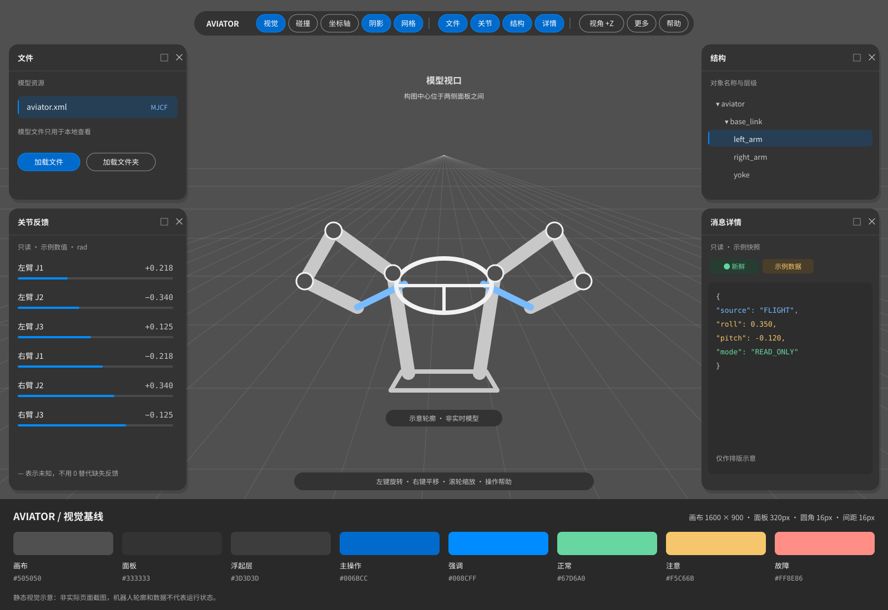

# AVIATOR Web UI 视觉设计规范

版本：1.0 · 日期：2026-10-01 · 状态：设计基线，待前端实现

本规范供 AVIATOR 的界面设计与前端开发使用，主要规定配色、页面布局和组件样式。视觉方向为：**中灰画布、深灰悬浮面板、紧凑胶囊工具条、蓝色交互强调、清晰的工程数据层级**。

参考 [Robot Viewer](https://viewer.robotsfan.com/) 的当前页面及用户提供的深色截图，采用其“场景居中、工具浮于四周”的组织方式。本文的 HEX 色值、尺寸、断点和组件规则是 AVIATOR 的建议设计值，不是对参考站 CSS 的逐项提取或像素复刻。参考日期为 2026-10-01。

适用范围包括模型查看、机器人状态监控和后续三维工作台。当前 [aviator_monitor](../nodes/aviator_monitor/README.md) 提供双 Tab 只读监控、URDF 状态显示与独立 RGB 预览，关节显示由实际消息和标定映射驱动；关节操作、代码编辑及其他工作台能力在本文中作为未来视觉场景。本次不修改运行界面、业务协议或控制权限。

## 1. 视觉方向与参考取舍

| 维度 | 参考画面中的特征 | AVIATOR 采用规则 |
| --- | --- | --- |
| 底色 | 大面积中灰三维场景 | 工作台使用中性灰，避免深蓝背景改变模型材质观感。 |
| 容器 | 四周深灰悬浮面板 | 用明暗差、圆角和轻阴影分层；面板不与画布同色。 |
| 导航 | 顶部居中胶囊工具条，功能分组 | 将视图开关、面板开关、辅助功能分组，用短分隔线区分。 |
| 强调色 | 蓝色用于开启或选中按钮 | 蓝色表示交互与选择；成功、警告、错误使用独立语义色。 |
| 字体 | 白色标题、灰色说明、小字号工具文字 | 保留紧凑感，同时提高说明文字亮度；工程正文以 14px 为基准。 |
| 细节 | 细边框、圆角按钮、底部操作提示 | 统一尺寸、状态和间距，减少装饰线与重复容器。 |

优先突出中央任务区域。除数据监控首页外，不在三维画布上方加入大标题横幅或大面积统计卡片；模型加载成功后也不挤压场景去放欢迎文案。渐变、强光晕及高饱和大面积底色不属于默认风格。

以下示意图展示本规范的色板和桌面工作台组合。图中机器人轮廓和数据为设计占位，不是模型渲染、实时状态或已实现功能。



## 2. 配色系统

### 2.1 中性色与交互色

| Token | 色值 | 用途 |
| --- | --- | --- |
| `--ui-bg-app` | `#292929` | 页面基础底色、面板背后的壳层。 |
| `--ui-bg-canvas` | `#505050` | 三维视口背景，保持中性。 |
| `--ui-bg-panel` | `#333333` | 默认面板和工具条，不透明。 |
| `--ui-bg-raised` | `#3D3D3D` | 输入框、菜单和嵌入区块。 |
| `--ui-bg-hover` | `#454545` | 中性按钮、列表行的悬停背景。 |
| `--ui-bg-code` | `#2D2D2D` | JSON/XML 阅读区和代码编辑区。 |
| `--ui-border-subtle` | `#4A4A4A` | 面板内部装饰分隔线；不作为交互控件唯一识别边界。 |
| `--ui-border-control` | `#929292` | 需要独立识别的输入框、按钮描边。 |
| `--ui-text-primary` | `#F2F2F2` | 标题、正文和关键数值。 |
| `--ui-text-secondary` | `#C8C8C8` | 字段标签、单位、次要信息。 |
| `--ui-text-muted` | `#A8A8A8` | 面板内辅助说明、空状态；不直接用于灰色画布上的小字。 |
| `--ui-text-canvas` | `#E0E0E0` | 画布标签；复杂模型背景上需加深灰标签底。 |
| `--ui-accent` | `#008CFF` | 选中描边、滑轨、选中标识和非文本高亮。 |
| `--ui-primary` | `#006BCC` | 白字主按钮及开启态填充，兼顾参考蓝色与文字对比度。 |
| `--ui-primary-hover` | `#0072D9` | 主按钮悬停。 |
| `--ui-primary-pressed` | `#0058A8` | 主按钮按下。 |
| `--ui-link` | `#79BBFF` | 深灰面板上的链接与可跳转文字。 |
| `--ui-focus` | `#7FC1FF` | 键盘焦点环。 |
| `--ui-bg-selected` | `#263F55` | 表格选中行、树节点选中背景。 |

明亮强调蓝不直接用作小号白字按钮底色：白色与 `#008CFF` 的对比度约为 3.39:1；主按钮改用 `#006BCC` 后约为 5.28:1。保留亮蓝作为图形强调，文字链接使用较浅的 `--ui-link`。

普通正文以至少 4.5:1 为设计验收目标；表达控件边界、焦点或状态的必要非文本标记以至少 3:1 为目标。对应依据为 [W3C 文字对比度说明](https://www.w3.org/WAI/WCAG22/Understanding/contrast-minimum.html) 和 [非文本对比度说明](https://www.w3.org/WAI/WCAG22/Understanding/non-text-contrast.html)。这是本规范采用的目标，不代表尚未实现的页面已通过无障碍验收。

| 已核算组合 | 对比度约值 | 使用条件 |
| --- | ---: | --- |
| `#F2F2F2` / `#333333` | 11.29:1 | 面板正文与标题。 |
| `#C8C8C8` / `#333333` | 7.55:1 | 字段与单位。 |
| `#A8A8A8` / `#333333` | 5.31:1 | 小号辅助文字。 |
| `#E0E0E0` / `#505050` | 6.11:1 | 无模型遮挡时的画布标签。 |
| `#FFFFFF` / `#006BCC` | 5.28:1 | 主按钮标签。 |

### 2.2 语义色

| 状态 | 前景 / 浅着色底 | 表现 |
| --- | --- | --- |
| 信息、已受理 | `#79BBFF` / `#263F55` | 信息图标＋文字；不表示动作完成。 |
| 正常、新鲜、完成 | `#67D6A0` / `#263E32` | 圆点或勾选＋具体状态文字。 |
| 注意、过期、结果未知 | `#F5C66B` / `#493E29` | 时钟或警告图标＋原因。 |
| 故障、拒绝、冲突 | `#FF8E86` / `#4A3030` | 错误图标＋状态；重要故障再增加局部边框。 |
| 离线、未加载、不可用 | `#A8A8A8` / `#3D3D3D` | 中性符号＋文字；与红色故障区分。 |

状态色控制在徽标、数值、局部边线或小提示条内，不把整张表或全部面板涂红。颜色始终与文字/图标共同表达。`FRESH`、`ACCEPTED`、`COMPLETED` 等标签保留各自业务含义，不统一换成“正常”；监控服务在线也不等于机器人就绪。

XYZ 坐标轴可用红 `#F28B82`、绿 `#81C995`、蓝 `#8AB4F8`，必须配 X/Y/Z 字母。坐标轴颜色属于空间标识，不表示故障等级。

## 3. 页面布局

### 3.1 三维工作台桌面布局

基准画板为 **1600×900 CSS px**。浏览器缩放按 100% 对照；设备像素比仅影响渲染清晰度，不用于放大组件的 CSS 尺寸。

| 区域 | 基准位置与尺寸 | 内容 |
| --- | --- | --- |
| 三维视口 | 全窗口铺底 | 场景、地面网格、模型、坐标指示。 |
| 顶部工具条 | 顶边 20px，水平居中；高 44px；宽随内容，最大 1120px | 视图、面板、辅助功能分组。 |
| 左上面板 | 左 16px、上 80px、宽 320px、高 280px | 模型/文件或数据源。 |
| 左下面板 | 左 16px、上 376px、宽 320px、下边距 16px | 关节、对象属性或状态列表。 |
| 右上面板 | 右 16px、上 80px、宽 320px、高 280px | 结构树或设备概览。 |
| 右下面板 | 右 16px、上 376px、宽 320px、下边距 16px | 消息详情、日志或未来编辑器。 |
| 底部提示条 | 中央区域底边 16px；高至少 32px | 鼠标操作、快捷键；不跨过两侧面板。 |

两侧面板与中央保留区域之间各留 16px，1600px 宽时中央无遮挡宽度为 `1600 − 2×16 − 2×320 − 2×16 = 896px`。自动“适配模型”应以无遮挡区域为构图中心，不以整窗中心和整窗宽度盲目计算。

面板头部固定，内容区独立滚动；工作台外层不出现双向页面滚动条。布局使用左右停靠列承载四个面板，避免所有尺寸都依赖硬编码绝对坐标。拖动/缩放如后续实现，需保留恢复默认布局入口，禁止把关闭按钮拖出屏幕。

默认采用不透明面板。参考画面的浮层感通过底色差和柔和阴影建立；可选模糊只用于工具条/底部提示，不用于连续滚动的数据表或代码区，以保持稳定对比度。

### 3.2 只读监控页的适配

当前监控页沿用相同配色、字体和组件，但使用正常文档流：顶部紧凑标题与连接状态，下面为整机摘要、数据流表、服务事务表和消息详情。内容最大宽度 1600px、页边距 24px、区块间隔 16px；详情可作为右侧抽屉，宽屏时也可分栏。

没有三维内容时，不画空网格、不留大片中央空白，也不展示不可用的“关节拖动”“模型编辑”等入口。保持只读标识，表格选择和查看详情使用蓝色；不加入看起来可操作真实机器人的主按钮。

### 3.3 响应式规则

以下断点依据**可用 CSS 视口宽度**，浏览器缩放后也应重新布局。

| 宽度 | 三维工作台 | 监控页 |
| --- | --- | --- |
| ≥1920px | 左右列各 360px，其余空间给视口。 | 最大内容宽 1600px，居中。 |
| 1440～1919px | 左右列各 320px，四面板默认可见。 | 四张摘要卡，表格保持完整。 |
| 1280～1439px | 左右列各 280px；工具条将次要操作收进“更多”。 | 摘要卡按空间变为两列，详情可折叠。 |
| 1024～1279px | 左列 280px；右列收为抽屉，默认关闭。 | 主表占满宽度，详情抽屉。 |
| 768～1023px | 两侧改为按需打开的抽屉，同一时刻只展开一侧。 | 两列摘要卡，表格在自身容器横向滚动。 |
| <768px | 视口占主区，面板改底部抽屉；只保留核心视图/面板入口。 | 单列摘要和区块；身份/状态列优先可见，其余可进入详情。 |

抽屉宽不超过 `min(360px, 视口宽 − 32px)`；移动底部抽屉最大高 70dvh，包含安全区留白。工具条无法容纳时移动次要项至菜单，不压缩字号或裁掉按钮。高度低于 720px 时，上方面板可降到 220px；内容区仍须可滚动。200% 缩放或文字放大时允许头部和工具组换行，避免固定高度裁切文字。

## 4. 尺寸、字体与层级

| 项目 | 设计值 |
| --- | --- |
| 间距标尺 | 4 / 8 / 12 / 16 / 24 / 32px；默认组件间距 8px，面板间距 16px。 |
| 面板圆角 | 16px；嵌入区块 10px；输入框 8px。 |
| 按钮圆角 | 普通动作 10px；开关、分段和工具条胶囊 999px。 |
| 边框 | 默认 1px；焦点环 2px，外偏移 2px。 |
| 面板阴影 | `0 8px 24px rgba(0,0,0,.18)`；不叠加高亮光晕。 |
| 面板头部 | 最小 48px；水平内边距 16px；标题与动作间距 12px。 |
| 面板内容 | 内边距 16px；密集树/表格可降到 12px。 |
| 控件高度 | 工具按钮至少 32px，普通按钮/输入框至少 36px。 |
| 图标与点击区 | 图标 16px、线宽 1.5～2px；图标按钮至少 32×32px，触屏至少 44×44px。 |
| 行高 | 正文 1.5；工具按钮 20px；代码约 1.6。 |

正文使用 `Inter, "Noto Sans SC", "Microsoft YaHei", system-ui, sans-serif`，未安装时直接回退，不要求联网下载字体。数值和代码使用 `"JetBrains Mono", "SFMono-Regular", Consolas, monospace`，动态数字启用 `font-variant-numeric: tabular-nums`。

| 层级 | 字号 / 字重 | 应用 |
| --- | --- | --- |
| 页面标题 | 20px / 600 | 监控首页标题；不用于工作台工具条。 |
| 面板标题 | 14px / 600 | 文件、关节、结构、详情。 |
| 正文与字段值 | 14px / 400 | 表格、属性、消息内容。 |
| 工具条与按钮 | 13px / 500 | 开关、操作按钮。 |
| 辅助说明与单位 | 12px / 400 | 提示、更新时间、单位；不用于重要错误正文。 |
| 核心指标 | 24px / 600 | 监控摘要卡，仅少量使用。 |

所有尺寸为默认密度；使用 `rem` 或可随文字增长的最小高度，不能靠 `transform: scale()` 缩小整个界面。长文件名和 Topic 单行省略，hover 和键盘焦点均可查看完整内容；关键状态、单位、正负号不截断。

层级顺序：画布 0 → 面板 10 → 活跃拖动面板 20 → 工具条 30 → 弹出菜单 40 → 抽屉/遮罩 50 → 模态对话框 60 → 对话框内提示 70。同一时刻只保留一个模态焦点域；普通浮层不能盖住模态操作。

## 5. 组件样式

### 5.1 工具条与按钮

工具条横向分组，容器内边距 6px，按钮间隔 6px，组间隔 12px，分隔线高 20px。开启态使用主蓝填充和白字，可同时开启多个视图开关；单选模式（如角度/弧度）用分段控件，不与多选开关混用。分组数量增加时优先收纳，不无限加长工具条。

| 状态 | 普通按钮 | 主按钮 / 开启态 |
| --- | --- | --- |
| 默认 | 面板同色或透明底、主文字、控件描边 | 主蓝填充、白字；需要时加亮蓝边线。 |
| Hover | `--ui-bg-hover` | `--ui-primary-hover`。 |
| Pressed | `--ui-bg-raised`，保持尺寸 | `--ui-primary-pressed`，不缩放按钮。 |
| Focus | 在原状态外加 `--ui-focus` 焦点环 | 同左，不能以 hover 代替键盘焦点。 |
| Disabled | `--ui-bg-raised`，灰字，停止 hover/按下变化 | 同左；原因在附近说明或通过可聚焦帮助入口解释。 |
| Loading | 保留文字及原宽度，左侧 14px 进度符号 | 阻止重复提交，不让其他按钮随文字变化移动。 |

面板关闭、展开、折叠用同一套线性 SVG 图标，避免混合 emoji、粗细不一的字符图标。图标按钮必须有可读名称；仅 hover 才出现的提示不能承担唯一说明。面板关闭后对应工具条开关变为未选中。

### 5.2 面板、空状态与加载

面板由标题、可选工具行、内容三部分构成。标题底部只有一条弱分隔线；不要再包一层同样的卡片。空状态放在内容区中央，12～14px 灰字、最多两行，必要时配一个明确动作。示例：“未加载模型”＋“加载文件”；“尚无有效反馈”＋原因或最近时间。

加载态采用局部进度条或静态占位骨架，底色 `--ui-bg-raised`，不使用连续高亮扫光。失败态保留上下文，显示简短原因与重试入口。空值用“—”并说明未知原因，不能默认显示 0；失联后的旧数据明确标注“旧快照”，不保留正常状态色。

### 5.3 输入框、关节行与单位

输入框背景 `--ui-bg-raised`、边框 `--ui-border-control`、高度至少 36px，左右内边距 10px。单位固定在值旁，如 `12.5 °`、`0.218 rad`、`50 Hz`；小数点列对齐。错误时使用红色边框及下方文字，不只依赖颜色。

未来关节调整行按“名称 → 数值/单位 → 滑轨 → 范围提示”排列；狭窄面板时分两行，不把长名称压成无法识别的缩写。滑轨厚 4px、滑块 14px，实际交互热区至少 32px 高；键盘焦点可见。只读关节反馈用数值和进度标记，不绘制看起来可拖动的滑块。任何可写关节功能须另行定义业务权限，本规范不授予控制能力。

### 5.4 树、数据表与状态徽标

树节点高度至少 32px，每级缩进 16px；展开箭头、对象图标和名称对齐。选中行使用 `--ui-bg-selected`＋左侧 2px 蓝线＋文字强调，hover 与 selected 必须可区分；展开与选择为不同操作。

表格默认行高至少 36px，横向内边距 12px，表头 12px/500、数据 13～14px。数字右对齐，名称和状态左对齐；轻横分隔线，通常不画密集竖线。表头可在表容器内固定，数据更新不改变列宽、不重新抢夺焦点。排序符号与当前排序字段一起显示。

状态徽标高至少 24px、左右内边距 8px、圆角 6px、字号 12px，组合“符号＋状态文字”。有边框的徽标不等于可点击按钮；可交互徽标需额外 hover/focus。A/B 通道角色、链路健康和控制授权分别显示，不能仅用一个蓝点同时代表三种含义。

### 5.5 代码与消息详情

使用 `--ui-bg-code`、等宽 13px 字体、约 21px 行高；外部留白 12px。XML 属性/JSON 键可用浅蓝，字符串浅绿，数值浅橙；普通标点用次文字色。只读消息明确标注“只读”，未来编辑器才出现“保存/未保存”。未保存使用黄色小徽标，语法错误才用红色。

长行在代码容器内横向滚动，或由用户开启换行，不撑破面板。复制按钮放在标题动作区，完成后原位显示“已复制”，不弹出遮挡正文的全屏提示。

### 5.6 三维场景与提示层

画布使用纯色 `#505050`。主网格建议白色 18% 透明度，次网格白色 8%；线宽以约 1 CSS px 的视觉强度为准，远处逐渐淡出。网格是空间辅助，不追求与界面文字相同的对比度，不应比模型轮廓更亮。模型材质保持自然灰阶，选中轮廓使用强调蓝；重要对象可通过轮廓、标签共同标识。

底部提示条用深灰底和浅色文字，仅将操作词加粗或用链接蓝强调。提示在窄屏时简化为“操作帮助”入口，不覆盖模型主体或事件通知。鼠标 hover、选中与模型隐藏状态分别定义；图中示意模型不得被误认为真实设备反馈。

## 6. 动效与可用性

颜色和透明度过渡 120ms，面板展开/收起 160ms；不使用弹簧、弹跳、旋转进入或持续发光。高频数据变化不触发整行动画，数值宽度固定。检测到 `prefers-reduced-motion: reduce` 时关闭非必要过渡。

键盘 Tab 顺序遵循顶部工具 → 左侧 → 中央辅助 → 右侧；抽屉打开后焦点进入抽屉，关闭后回到触发按钮。拖动/缩放面板须有菜单或按钮替代操作。触屏采用至少 44px 点击热区；本项目桌面至少 32px 的建议也高于 W3C 2.5.8 通常要求的 24 CSS px 最小目标尺寸，具体例外见 [目标尺寸说明](https://www.w3.org/WAI/WCAG22/Understanding/target-size-minimum.html)。

## 7. CSS Token 与基础组件示例

以下为无框架依赖的视觉参考，可用于现有原生 HTML/CSS 页面。布局行为、数据绑定、弹层焦点管理和权限由实际实现补充。

```css
:root {
  color-scheme: dark;
  --ui-bg-app: #292929;
  --ui-bg-canvas: #505050;
  --ui-bg-panel: #333333;
  --ui-bg-raised: #3D3D3D;
  --ui-bg-hover: #454545;
  --ui-bg-code: #2D2D2D;
  --ui-border-subtle: #4A4A4A;
  --ui-border-control: #929292;
  --ui-text-primary: #F2F2F2;
  --ui-text-secondary: #C8C8C8;
  --ui-text-muted: #A8A8A8;
  --ui-text-canvas: #E0E0E0;
  --ui-accent: #008CFF;
  --ui-primary: #006BCC;
  --ui-primary-hover: #0072D9;
  --ui-primary-pressed: #0058A8;
  --ui-link: #79BBFF;
  --ui-focus: #7FC1FF;
  --ui-bg-selected: #263F55;
  --ui-info: #79BBFF;
  --ui-success: #67D6A0;
  --ui-warning: #F5C66B;
  --ui-danger: #FF8E86;
  --ui-space-1: 4px;
  --ui-space-2: 8px;
  --ui-space-3: 12px;
  --ui-space-4: 16px;
  --ui-space-6: 24px;
  --ui-space-8: 32px;
  --ui-radius-panel: 16px;
  --ui-radius-control: 10px;
  --ui-shadow-panel: 0 8px 24px rgb(0 0 0 / 18%);
  --ui-font: Inter, "Noto Sans SC", "Microsoft YaHei", system-ui, sans-serif;
  --ui-font-mono: "JetBrains Mono", "SFMono-Regular", Consolas, monospace;
}
.ui-panel {
  min-width: 0; min-height: 0;
  display: flex; flex-direction: column;
  color: var(--ui-text-primary); background: var(--ui-bg-panel);
  border-radius: var(--ui-radius-panel); box-shadow: var(--ui-shadow-panel);
  font: 400 .875rem/1.5 var(--ui-font);
}
.ui-panel__header {
  min-height: 48px; padding: 8px 16px; box-sizing: border-box;
  display: flex; flex-wrap: wrap; align-items: center; gap: 12px;
  border-bottom: 1px solid var(--ui-border-subtle);
}
.ui-panel__body { min-height: 0; padding: 16px; overflow: auto; }
.ui-button {
  min-height: 36px; padding: 6px 12px; box-sizing: border-box;
  color: var(--ui-text-primary); background: transparent;
  border: 1px solid var(--ui-border-control); border-radius: var(--ui-radius-control);
  font: 500 .8125rem/1.25rem var(--ui-font); cursor: pointer;
  transition: background-color 120ms, border-color 120ms;
}
.ui-button:hover:not(:disabled) { background: var(--ui-bg-hover); }
.ui-button:active:not(:disabled) { background: var(--ui-bg-raised); }
.ui-button--primary, .ui-button[aria-pressed="true"] {
  color: #fff; background: var(--ui-primary); border-color: var(--ui-accent);
}
.ui-button--primary:hover:not(:disabled), .ui-button[aria-pressed="true"]:hover:not(:disabled) {
  background: var(--ui-primary-hover);
}
.ui-button--primary:active:not(:disabled), .ui-button[aria-pressed="true"]:active:not(:disabled) {
  background: var(--ui-primary-pressed);
}
.ui-button:disabled {
  color: var(--ui-text-muted); background: var(--ui-bg-raised);
  border-color: var(--ui-border-subtle); cursor: not-allowed;
}
:where(button, input, select, textarea, a, [tabindex]):focus-visible {
  outline: 2px solid var(--ui-focus); outline-offset: 2px;
}
.ui-value { font-family: var(--ui-font-mono); font-variant-numeric: tabular-nums; }
@media (pointer: coarse) { .ui-button { min-height: 44px; min-width: 44px; } }
@media (prefers-reduced-motion: reduce) { .ui-button { transition: none; } }
```

亮色主题不纳入本版基线。若后续提供，需另行定义完整语义色和三维背景映射，不能简单反转 HEX 值。

## 8. 交付与视觉验收

实现时提供 1600×900、1280×720、1024×768 和 390×844 四档截图，覆盖默认、选中、hover、focus、disabled、加载、空数据、故障与失联状态。工作台和监控页分别验收，不把布局示意图当作运行效果截图。

- 配色使用统一 Token，没有旧蓝黑色卡片与新中性灰面板混用。
- 面板圆角、标题高度、按钮尺寸和 4px 间距标尺一致；文字放大不裁切。
- 桌面中央区域保留完整场景，窄屏抽屉不导致页面横向溢出；表格和代码仅在自身容器滚动。
- 选中、hover、focus、禁用各自可辨认；状态同时有文字或图标，不只靠颜色。
- 检查实际背景上的文字和边界对比度，尤其是透明叠加、蓝底白字与小号说明。
- 长 Topic、长文件名、负值、小数、单位、未知值及旧快照标记显示完整且不跳动。
- 当前监控页继续只读；未来三维、编辑、控制等功能的设计与实现单独评审。

配套文件：[视觉参考图](assets/aviator_web_ui_visual_reference.svg)。设计参考为 [Robot Viewer](https://viewer.robotsfan.com/) 与用户提供截图；工程接入背景见 [aviator_monitor 说明](../nodes/aviator_monitor/README.md)。
